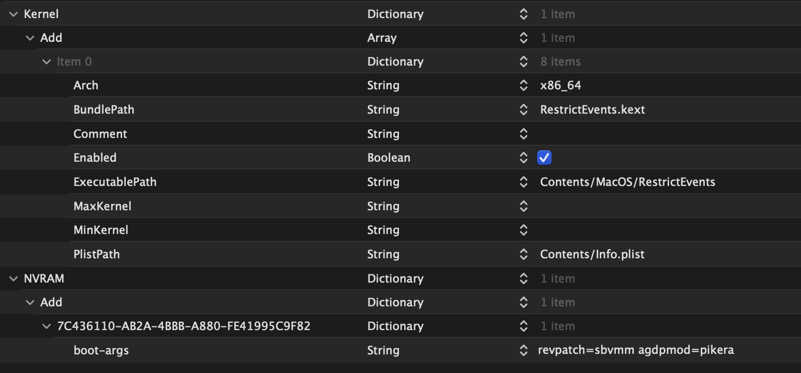
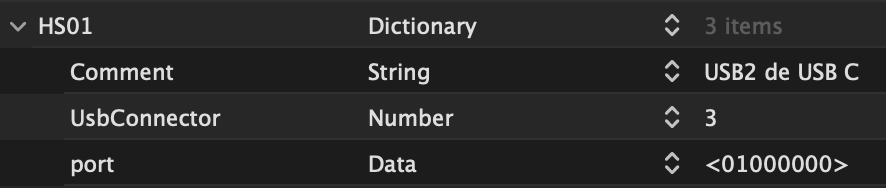
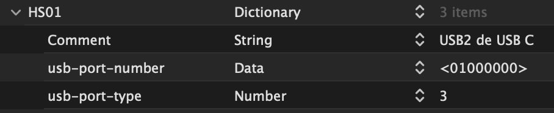
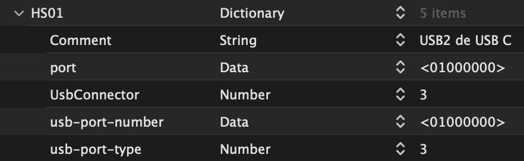

# macOS 26 Tahoe on Z390 with OpenCore

Apple has released the beta version of macOS 26 Tahoe. This will be the last version compatible with Intel processors. It's possible to install Tahoe on my computer, but there are some considerations for this macOS. The main ones relate to updating OpenCore and kexts, USB port mapping, sound (AppleHDA.kext) and the Fenvi T919 Wi-Fi (all Broadcom Wi-Fi that could be used on Sonoma and Sequoia with the OCLP root patch). Some of these issues have already been solved. Others are still pending. My machine specifications are: Z390 Aorus Elite + i9-9900K + RX 6600 XT.

### Supported Intel SMBIOS

- iMac 20,1 / iMac 20,2
- MacPro 7,1
- MacBookPro 16,1 / MacBookPro 16,2 / MacBookPro 16,4

As you can see, only a few models can update to Tahoe. It's possible to use unsupported SMBIOS with a patch that bypasses this check (*skip board-id patch*). All supported models have T2 chip, which is important for update notifications from System Settings (OTA: Over The Air updates).

### Hardware

- Gigabyte Z390 Aorus Elite Motherboard
- Intel i9-9900K Processor
- Graphics: Intel UHD 630 iGPU / AMD Radeon RX 6600 XT
- Realtek ALC1220 Sound
- Intel I219V7 Ethernet
- Wi-Fi + BT Fenvi FV-T919 (BCM94360CD).

### BIOS Setup (F11 Version)

- CSM: Disabled (required)
- VT-d: Disabled
- Platform Power Management: Disabled
- XHCI Hand-Off: Enabled
- Network Stack: Disabled
- Wake on LAN: Disabled
- Initial Display Output: PCIe 1 Slot
- Integrated Graphics: Enabled
- DVMT Pre-allocated: 256M or higher
- Above 4G Decoding: Enabled
- CFG Lock: Disabled (required)
- Fast Boot: Disabled
- OS Type: Windows 8/10
- Secure Boot: Disabled.

### What works well?

- AMD graphics card as primary (iMac 20,2) or single (MacPro 7,1)
- Integrated graphics card in headless mode (iMac 20,2)
- Shutdown and restart
- Ethernet
- Audio through HDMI or DisplayPort ports on the AMD card
- Fenvi T919 Bluetooth.

### What's not working properly?

- USB ports map (adaptation required due to changes in the internal format in Tahoe). It has a solution.
- Audio from the motherboard chip (due to the absence of AppleHDA.kext). It has a solution.
- Fenvi Wi-Fi: There is no solution yet, although OCLP developers are working on it. An Intel Wi-Fi can be used successfully instead (I've tested the AX210) but AirportItlwm.kext doesn't work in Tahoe and you must use itlwm.kext + Heliport app (latest versions of both).

### OpenCore 1.0.5

Most of the OpenCore tweaks that were valid for Sequoia are also valid for Tahoe. Main differences are in OpenCore and kexts updated versions:

- OpenCore 1.0.5
- Lilu 1.7.1
- VirtualSMC 1.3.7
- CPUFriend 1.3.0 (MacPro 7,1 only) (optional)
- RestrictEvents 1.1.6 (MacPro 7,1 only)
- WhateverGreen 1.7.0 (iMac 20,2 only)
- NVMeFix 1.1.3
- itlwm 2.3.0

### config.plist

I can use two SMBIOS: MacPro 7,1 with the iGPU disabled in BIOS and iMac 20,2 with the iGPU enabled in BIOS as a secondary card. These are the main details when configuring config.plist:

- ACPI
	- SSDT-EC-USBX.aml, SSDT-PLUG.aml, and SSDT-PMC.aml. SSDT-AWAC.aml is not needed on my system but, when in doubt, add it because it won't cause any harm if it's present unnecessarily.
	- Quirks: All = False
- Booter
	- Quirks: AvoidRuntimeDefrag, DevirtualizeMMIO, EnableSafeModeSlide, ProtectUefiServices, ProvideCustomSlide, RebuildAppleMemoryMap, SetupVirtualMap, and SyncRuntimePermissions = True
	- ResizeAppleGpuBars = -1
- DeviceProperties
	- Add
		- PciRoot(0x0)/Pci(0x2,0x0)
			- AAPL,ig-platform-id | Data | 0300913E
			- device-id | Data | 9B3E0000
			- enable-metal | Data | 01000000
			- rps-control | Data | 01000000
		- PciRoot(0x0)/Pci(0x1.0x0)/Pci(0x0.0x0)/Pci(0x0.0x0)/Pci(0x0.0x0)
			- unfairgva | Number | 6
		- PciRoot(0x0)/Pci(0x1F,0x3)
			- layout-id | Data | 07000000
		- PciRoot(0x0)/Pci(0x14,0x0)
			- acpi-wake-type | Data | 01
- Kernel
	- Add: recent versions of used extensions, Lilu.kext in the first place
	- Quirks: CustomSMBIOSGuid, DisableIoMapper, DisableIoMapperMapping, DisableLinkeditJettison, PanicNoKextDump and PowerTimeoutKernelPanic = True, SetApfsTrimTimeout = 0
- Misc
	- Boot: HibernateMode=None, PickerAttributes=144, PickerVariant=Default (can be Acidanthera/GoldenGate or whatever theme you use), HideAuxiliary=True, ShowPicker=True
	- Debug: AppleDebug, ApplePanic and DisableWatchDog = True, Target=3
	- Security: AllowSetDefault=True, BlacklistAppleUpdate=True, ExposeSensitiveData=6, SecureBootModel=Disabled
- NVRAM
	- WriteFlash=True
	- Add >> 7C436110-AB2A-4BBB-A880-FE41995C9F82:
		- boot-args >> agdpmod=pikera (only iMac20,2)
		- csr-active-config >> 03080000
		- run-efi-updater >> No
	- Delete >> 7C436110-AB2A-4BBB-A880-FE41995C9F82:
		- boot-args and csr-active-config
- PlatformInfo
	- Generic >> iMac20,2 / MacPro7,1
	- UpdateDataHub, UpdateNVRAM and UpdateSMBIOS = True
	- UpdateSMBIOSMode >> Custom
- UEFI
	- Quirks: RequestBootVarRouting = True, ResizeGpuBars=-1.

### Update Notifications

All supported models have T2 chip, so by default Hacks don't receive notifications of new updates from System Settings. To receive these notifications, you must add:

- RestrictEvents.kext
- revpatch=sbvmm to boot args. revpatch=sbvmm makes macOS believe it's in a virtual machine and, in this case, SMBIOS model with a T2 chip doesn't matter.

 

 

Another option is to download the full installer package each time, bypassing this limitation, but these are large packages, over 17 GB in size.

### USB Port Map

Apple has changed the name of the USB port properties in the USBMap.kext files in macOS Tahoe. Where previously there was:

 

 

it has now changed to:

 

 

You can have all four properties simultaneously so that the same ports map works in Tahoe and earlier macOS.

 

 

To make the change, you have the option of doing it manually or using *corpnewt's* [USBMap tool](https://github.com/corpnewt/USBMap), which has been updated to add the new properties to existing maps. Once downloaded, run USBMapInjectorEdit.command, drag a USBMap.kext or USBPorts.kext file and apply the change.

Note: Comment property is not part of Apple ports maps but it is useful information that Hackintool shows in the USB tab.

### Integrated Audio

Although AppleHDA.kext was present in the first beta of macOS Tahoe, it has been removed by Apple from subsequent betas and does not appear to be reintroduced into the system. Without this extension it's impossible to manage audio from the motherboard chip and AppleALC.kext is useless, so the integrated audio source has been lost. Apple Silicon Macs manage audio via the T2 chip; they don't need AppleHDA.kext and Apple has decided not to maintain it.

Direct options include:

- Audio via HDMI or DisplayPort from the AMD graphics card ports.
- USB sound devices (automatically recognized by macOS; plug and play). I've tried the Sound Blaster Play! 3 device, which costs less than €20, and I'm very satisfied with the sound quality but it has two drawbacks:
	- It only has two connectors: one input and one output.
	- Although its CPU usage is minimal, it's slightly higher than that of the integrated audio.
- VoodooHDA.kext: Audio driver less commonly used than AppleALC.kext. Available on the CloverHackyColor GitHub site (current developer: *Sergey Slice*). *Chris1111* has a utility on his GitHub site that automates the VoodooHDA installation process on Tahoe (**VoodooHDA-Tahoe**). I haven't tried it but some users have solved audio issue with it.

The most desired solution is reinstalling AppleHDA.kext. This can already be done thanks to recently emerged projects: [MyKextInstaller](https://github.com/Mirone/MyKextInstaller) by *Mirone* and [SimpleLoader](https://github.com/laobamac/SimpleLoader) by *laobamac*. Both projects are on GitHub. I've tested both and they worked well. More info at: [AppleHDA back in Tahoe](https://github.com/perez987/AppleHDA-back-on-macOS-26-Tahoe).

### Intel Wi-Fi

- AirportItlwm doesn't work on Tahoe, but itlwm does; the latest version is 2.3.0.
- Heliport (used next to itlwm) is at version 1.5.0, although there is a 2.0.0-alpha version that works very well on Tahoe. Extended Instructions: [Wi-Fi Intel AX210 on macOS Sonoma and Sequoia](https://github.com/perez987/Intel-AX210-on-macOS-Sonoma-Sequoia)
- Fenvi Wi-Fi: There is no fix for this issue yet. OCLP developers are working on it.

### EFI folder with OpenCore 1.0.5

It has two config.plist files:

- config-macpro.plist
	- SMBIOS MacPro7,1
	- IMPORTANT: Fill in your personal numbers in PlatformInfo >> Generic
	- iGPU Disabled in BIOS
	- Does not use WhateverGreen
	- Don't forget to rename config-imac.plist to config.plist.

- config-imac.plist
	- SMBIOS iMac20,2
	- IMPORTANT: Fill in your personal numbers in PlatformInfo >> Generic
	- iGPU wireless (headless mode), AMD as the primary card
	- iGPU Enabled in BIOS
	- unfairgva=6 in the dGPU properties to have DRM (partial)
	- Requires WhateverGreen, which has an issue with Tahoe (at least up to the current beta 5): it fails during clean install so you have to use config-macpro.plist for the installation. Afterwards, you can keep config-imac.plist for daily use.
	- Don't forget to rename config-imac.plist to config.plist.

Both config.plists work for diferent macOS thanks to the MinKernel and MaxKernel properties of the kexts:

- macOS Ventura: Fenvi Wi-Fi that works as is, no kexts are added
- macOS Sonoma and Sequoia: Fenvi Wi-Fi that requires the settings by OCLP (IOSkywalkFamily.kext, IO80211FamilyLegacy.kext, etc.). MinKernel = 23.0.0 and MaxKernel = 24.20.0
- macOS Tahoe: Intel Wi-Fi (AX210 with itlwm.kext) since Fenvi doesn't work for now. MinKernel = 25.0.0.

I use the Fenvi Bluetooth, which works as is on all four systems. AX210 card's Bluetooth is disconnected from the motherboard.

So the same EFI works for me to boot from Ventura to Tahoe. Modify it according to your hardware.

You can download the EFI with OpenCore 1.0.5 from [here](https://perez987.es/wp-content/uploads/2024/07/EFI-15-1.1.0.zip).
